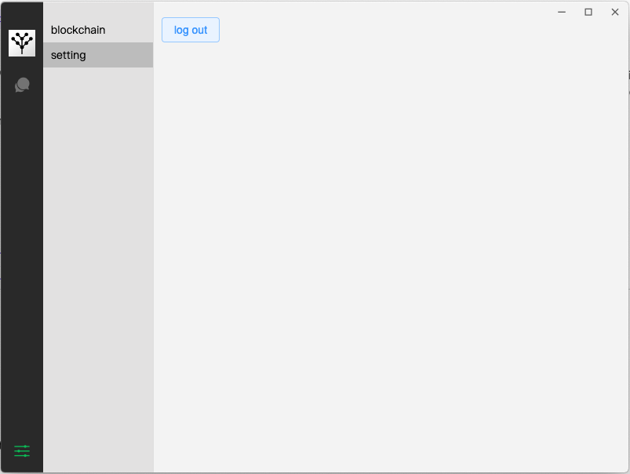

# Project Name

electron-ylide-chat

# Project description

This project is a desktop application chat system.

Project use electron to build desktop application, connect wallet by scan the QRCode on the desktop application through the mobile phone.

It is more convenient for users to chat with other address by using desktop application.

## support feature

- chat with other address
- you can add new address to chat by search bar
- support Arbitrum mainnet
- support rainbow、metamask、argent、trust、imtoken、pillar wallet to scan walletconnect qrcode

# Future

1. Currently we only provide Arbitrum mainnet, It will support more chain like Ethereum、BNB Chain、Avalanche、Everscale ...

2. add contracts list that make users find the address to chat faster

The desktop application will continue to optimize ..., Please wait for our good news！

# Project run

```
pnpm install
pnpm dev
```

📝 you need to write your infura id in env VITE_projectId

# Project requirements

- Node v16.14.0

# Demo by youtube

- [youtube](https://youtu.be/DPiCjQLPe3s)

# Demo by Picture

- Use your mobile phone to scan the code QRCode to log in


- input your communication key (If it's first time input, you need to registering communication key)


- you can chat with other address


- If you want to add new address to chat, you can use search bar


- Currently only provided Arbitrum chain, in the future, you can change chain in this section


- Currently only provided log out, in the future, ylide protocal support more relate account setting, we will support it.



# Team

[leowang](https://github.com/LeoWangJ)

# Contact Info

- Discord ID - leoJ#5012
- Email ID - [rfv7855659@gmail.com](mailto:rfv7855659@gmail.com)
- Gitcoin - [leowangj](https://gitcoin.co/leowangj)
